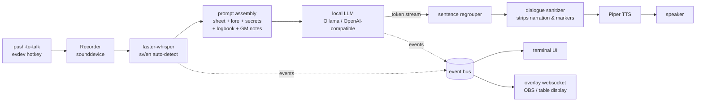

# Architecture

`npc` is a fully-offline voice agent that role-plays a TTRPG NPC: hold a
key, speak, and a local LLM answers aloud in character. This document is the
map for people who want to read or change the code.

## The pipeline



Everything runs on one machine. Nothing ever calls the internet.

## Threads and state

Four threads, coordinated by `NPCApp` (`src/npc/app.py`), a state machine
`IDLE → RECORDING → PROCESSING → SPEAKING`:

1. **Main** — the `prompt_toolkit` REPL (`gm>`), where typed lines are
   out-of-character GM instructions and `/commands`.
2. **Hotkey listener** — evdev key-down/key-up (terminals don't deliver
   key-up, which is why this exists). Pressing the key while the NPC speaks
   is barge-in: playback stops, recording starts.
3. **Worker** — a single queue serializes every turn (STT → LLM → TTS) and
   every state-touching command, so nothing races.
4. **Audio callback** — sounddevice's thread, which only copies samples.

Voice input is *always* in-character player dialogue; the keyboard is
*always* the GM. That split is the core interaction design.

## Events, not prints

The app never prints. It emits typed events (`src/npc/events.py`) —
`PlayerSpoke`, `NpcReplied`, `SecretRevealRequested`, … — to one callback;
the CLI renders them, tests assert on them, and the overlay broadcasts them
as JSON. Two class-level flags form the exposure contract:

- `dm_only` — never leaves the machine (everything about secrets).
- `table_safe` — the only events broadcast when the overlay listens on the
  LAN; GM notes, status, and errors are neither and stay home.

## The campaign directory

A campaign is a folder of plain markdown — the whole "database":

```
character.md      who the NPC is (first # heading = display name)
characters/*.md   or several NPCs; /npc switches at the table
adventure.md      GM background
secrets.md        GM-gated clues — see below
lore/             reference docs injected as established fact
logbook.md        per-NPC session memory, written by the LLM
sessions/         raw transcripts, appended crash-safe every turn
config.toml       models, voices, hotkey — all optional
```

Every piece of per-NPC state (sheet, history, GM notes, logbook, secrets,
lore, voice) lives on one `CharacterSlot` (`src/npc/roster.py`); switching
NPCs swaps the slot. Memory is strictly per-NPC, in-session and across
sessions.

## Five guarantees

1. **Fully offline.** Whisper, the LLM, and Piper are all local; the only
   network listener is the overlay, loopback-bound unless you opt in.
2. **Per-NPC isolation.** What players tell one NPC never reaches another —
   not in the prompt, not in the logbook, not in the summaries.
3. **Secrets can't leak.** Gated clues never enter the prompt until the GM
   approves at the console; the model cannot reveal text it has never seen.
   (`scripts/probe_secrets.py` pins the behavior against a real model.)
4. **English out, always.** Players can speak Swedish; replies are forced to
   English (the TTS voice's language) by prompt rules plus a detector with
   a corrective re-ask — the prompt alone doesn't survive baiting.
5. **Crash-safe writes.** Logbooks and secrets write via temp-file +
   `os.replace`; transcripts append per turn. A crash costs nothing.

## Seams

Every hardware/model dependency sits behind a small Protocol —
`Transcriber`, `Speaker`, `Recorder`, the LLM clients — and the entire test
suite (280+ tests) runs against fakes: no GPU, no microphone, no server.
`tests/test_app_pipeline.py` is the best starting point for how the pieces
meet; `npc doctor` is the runtime mirror of the same seams.

## Reading order

`events.py` → `app.py` → `session/prompt.py` → `roster.py`, then whichever
seam you care about (`stt.py`, `tts.py`, `llm.py`, `overlay.py`,
`session/secrets.py`, `session/lore.py`).
