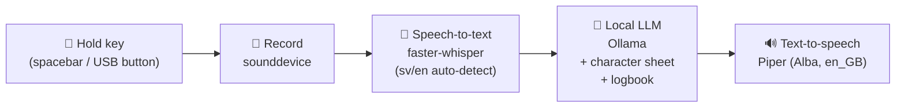

# npc — an offline AI NPC for your game table

[](https://en.wikipedia.org/wiki/Vibe_coding)
[](https://claude.com/claude-code)
[](LICENSE)

**Hold a button, talk to an NPC, and it talks back — in character, out loud,
with no cloud in sight.**

`npc` is a terminal program for game masters running tabletop RPGs like
[Numenera](https://numenera.com). You describe an NPC in a markdown file, start
a session, and hand your players a voice: hold the push-to-talk key, speak as a
player (in English **or Swedish**), and the NPC answers in spoken British
English, staying true to its personality, knowledge, and secrets. Between
sessions the NPC keeps a logbook, so it remembers what your party did last time.

Everything runs **locally on your own machine**. After the one-time model
downloads, no internet connection is used — your campaign never leaves the table.

## How it works



Two channels, one terminal:

| Input | Meaning |
|---|---|
| **Voice** (hold the push-to-talk key) | Always **in-character player dialogue** — the NPC hears a player speaking to it |
| **Typed text** at the `gm>` prompt | Always an **out-of-character instruction** to the underlying LLM — *"be more hostile"*, *"you just saw them steal your idol"* |

This separation is absolute by design: the LLM can never mistake table chatter
for stage direction, and your players can never "prompt-inject" the NPC by
talking to it.

## Requirements

- Linux (X11 or Wayland — push-to-talk works on both)
- Python ≥ 3.11 and [uv](https://docs.astral.sh/uv/)
- A local LLM server: [Ollama](https://ollama.com) (default) — **or** any app
  serving an OpenAI-compatible API, like [Jan](https://jan.ai),
  [LM Studio](https://lmstudio.ai), llama.cpp's server, or vLLM
- A microphone and speakers
- Optional but recommended: an NVIDIA GPU (a 7B–14B model + GPU whisper make
  responses fast enough for live play; CPU-only works with smaller models)

Disk footprint after setup: roughly 5–6 GB (LLM ≈ 4.5 GB, whisper-small
≈ 0.5 GB, Piper voice ≈ 60 MB).

## Installation

### 1. System packages (Ubuntu/Debian)

```bash
sudo apt install libportaudio2        # microphone & speaker access for Python
sudo usermod -aG input $USER          # lets npc read key press/release events
```

**Log out and back in** after the `usermod` — group changes only apply to new
logins. (Why: terminals never report key *releases*, so hold-to-talk reads the
keyboard device directly via evdev, which requires membership in the `input`
group. No root needed.)

### 2. A local LLM server

**Option A — Ollama** (default, fully terminal-driven):

```bash
curl -fsSL https://ollama.com/install.sh | sh
ollama pull qwen2.5:7b-instruct       # the default model (~4.5 GB)
```

**Option B — an LLM app you already run** (Jan, LM Studio, llama.cpp, vLLM, …):
no extra software needed. Enable the app's local API server, load a model, and
point `config.toml` at it — see
[Using Jan, LM Studio, or another LLM app](#using-jan-lm-studio-or-another-llm-app).

### 3. This project

```bash
git clone https://github.com/seetee/npc.git
cd npc
uv sync                               # CPU-only
uv sync --extra cuda                  # with NVIDIA GPU (adds CUDA libs for whisper)
```

### 4. Check everything

```bash
uv run npc init campaigns/mygame      # scaffold a campaign
uv run npc doctor campaigns/mygame    # verify + download speech models
```

`doctor` checks every link in the chain — Ollama running, model pulled,
whisper cached, Piper voice downloaded, audio devices present, input
permissions — and prints a copy-pasteable fix for anything that fails. Run it
until everything says `PASS`. The whisper model and Piper voice download
automatically on the first run; after that you're fully offline.

## Creating your NPC

`npc init` gives you a campaign directory of plain markdown — edit freely, no
special syntax:

```
campaigns/mygame/
├── character.md    # WHO the NPC is: personality, speech style, knowledge,
│                   # secrets, hard rules. First "# heading" = the NPC's name.
├── adventure.md    # your campaign background, from the GM's point of view
├── logbook.md      # session summaries — written by the LLM, editable by you
├── config.toml     # models, voice, hotkey (all optional, defaults included)
└── sessions/       # raw per-session transcripts, appended turn by turn
```

The scaffolded `character.md` contains a complete example NPC (Vess, a wary
Aeon Priest) showing the intended level of detail. The **Secrets** and **Hard
rules** sections are where you control what the NPC will and won't reveal.

## Playing a session

```bash
uv run npc run campaigns/mygame
```

| At the `gm>` prompt | Effect |
|---|---|
| **hold spacebar**, speak, release | player speaks to the NPC; it answers out loud |
| press while the NPC is talking | interrupts the reply and starts recording (walkie-talkie style) |
| type anything | out-of-character instruction to the LLM |
| `/say Have you seen the raiders?` | typed in-character player line (no mic needed) |
| `/save` | write the session summary to the logbook now |
| `/reload` | re-read `character.md`, `adventure.md`, `config.toml` |
| `/status` | current state, model, session number |
| `/end` | summarize the session into the logbook and exit |
| `/quit` | exit without saving a summary |

Ending with `/end` is what gives the NPC memory: the LLM distills the session's
transcript into a dated logbook entry (location, the NPC's attitude, highlights,
open threads), and the most recent entries are fed back to it next session. The
logbook also auto-checkpoints every 20 player turns, so a crash costs you
nothing.

> **Tell your table:** everything said to the NPC is transcribed and stored
> locally in `sessions/`, and summarized into the logbook. It never leaves the
> machine — but recording people's words is still something your players should
> know about and be okay with.

## Choosing and changing models

`config.toml` is scaffolded with every setting present as a comment showing
its default:

```toml
[llm]
# backend = "ollama"                # or "openai" for Jan, LM Studio, llama.cpp, …
# model = "qwen2.5:7b-instruct"     # Ollama tag, or the model name your app lists
# host = "http://localhost:11434"
[stt]
# model = "small"                   # whisper size: tiny/base/small/medium/large-v3
# language = "auto"                 # auto-detects Swedish and English
[tts]
# voice = "en_GB-alba-medium"       # Piper voice (Alba, British English)
```

Uncomment and edit to change. **The LLM model can be swapped mid-session**:
edit `config.toml`, type `/reload`, and the next reply comes from the new model
(handy if an NPC turns out to need more brainpower — or less). Whisper and
Piper models are loaded into memory at startup, so changing those takes effect
on the next `npc run`; `/reload` will tell you when a restart is needed.

Rough model guidance:

| Hardware | LLM | Whisper |
|---|---|---|
| CPU only | `qwen2.5:3b-instruct`, `llama3.2:3b` | `base` or `small` |
| 8 GB VRAM | `qwen2.5:7b-instruct` (default), `llama3.1:8b` | `small` |
| 12+ GB VRAM | `qwen2.5:14b-instruct`, `mistral-nemo` | `small` or `medium` |

### Using Jan, LM Studio, or another LLM app

If a machine already runs an LLM app, `npc` can use it instead of Ollama —
anything that serves the standard OpenAI-compatible API works. In the app,
enable its local API server and note the model name it exposes, then:

```toml
[llm]
backend = "openai"                     # aliases: jan, lmstudio, llamacpp, vllm
host = "http://localhost:1337"         # Jan's default; LM Studio uses :1234
model = "qwen2.5-7b-instruct"          # exactly as the app lists it
```

(`/v1` is appended automatically if you leave it off.) `npc doctor` will show
which models the server actually offers if the configured name doesn't match.
The mid-session `/reload` model swap works the same as with Ollama.

## Languages

Players can speak **Swedish or English** — whisper auto-detects the language
per utterance. The NPC always *answers* in English with the Alba voice; this is
enforced in its instructions, so a Swedish question gets an English answer.
Pin `stt.language = "sv"` in `config.toml` if auto-detection ever guesses wrong.

## Using a hardware button

Any USB device that emits key events works — a foot pedal, a macro pad, a
Shuttle controller. Find it and pin it:

```bash
ls /dev/input/by-id/
```

```toml
[hotkey]
key = "KEY_F13"                                  # whatever your button sends
device = "/dev/input/by-id/usb-...-event-kbd"    # pin this exact device
grab = true                                      # exclusive: presses never leak to the terminal
```

Only enable `grab` for a *dedicated* button — grabbing your actual keyboard
would swallow all your typing. Without a dedicated button, if holding spacebar
leaves stray spaces annoying you, switch `key` to `KEY_RIGHTCTRL` or `KEY_F12`.

## Development

```bash
uv sync --group dev
uv run pytest                  # unit tests — no audio hardware or Ollama needed
uv run pytest -m integration   # real whisper/piper/ollama smoke tests (auto-skip)
uv run ruff check .

uv run npc say "test" campaigns/mygame            # debug: TTS only
uv run npc transcribe clip.wav campaigns/mygame   # debug: STT only
```

The pipeline (`src/npc/app.py`) is a small state machine
(`IDLE → RECORDING → PROCESSING → SPEAKING`) with every stage behind a
Protocol — recorder, transcriber, LLM, speaker — so the full loop is tested
with fakes and no hardware. The recorder seam exists for the planned v2 mode:
press once to start, voice-activity detection stops automatically.

## License

[AGPL-3.0-or-later](LICENSE). Piper is GPL-3.0; whisper, Ollama and the models
carry their own licenses.
